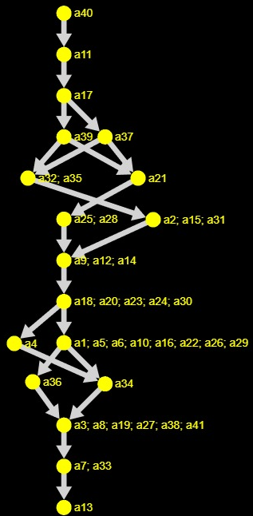

# ELECTRE3-SAD

Projeto de Teoria de decisão multi-critério feito na cadeira de Sistemas de Apoio à Decisão

Programa utilizado em:
www.github.com/Valdecy

Canvas do projeto:

CANVAS1
https://www.canva.com/design/DAFu1kx9u00/_K6jptGRSf1gXOTfN4jcpw/edit?utm_content=DAFu1kx9u00&utm_campaign=designshare&utm_medium=link2&utm_source=sharebutton

CANVAS2
https://www.canva.com/design/DAFvlXqpQpk/A-JtkrPWf6zjU7640XfxQg/edit?utm_content=DAFvlXqpQpk&utm_campaign=designshare&utm_medium=link2&utm_source=sharebutton

Contribuidores

<table>
  <tr>
    <td align="center">
      <a href="https://www.linkedin.com/in/luis-felipe-araujo-mota-415851210/">
         
        
          <b>Luis Felipe Mota</b>
        
      </a>
    </td>
    <td align="center">
      <a href="https://www.linkedin.com/in/paulo-vitor-oliveira-431bb118b/">
         
        
          <b>Paulo Vitor</b>
        
      </a>
    </td>
    <td align="center">
      <a href="https://www.linkedin.com/in/gabriel-laroche-borba-328b31232/">
         
        
          <b>Gabriel Laroche</b>
        
      </a>
    </td>
     <td align="center">
      <a href="">
         
        
          <b>Giovanni</b>
        
      </a>
        <td align="center">
      <a href="">
         
        
          <b>Luiz Felipe Aciolly</b>
        
      </a>
    </td>
    </td>
  </tr>
</table>
